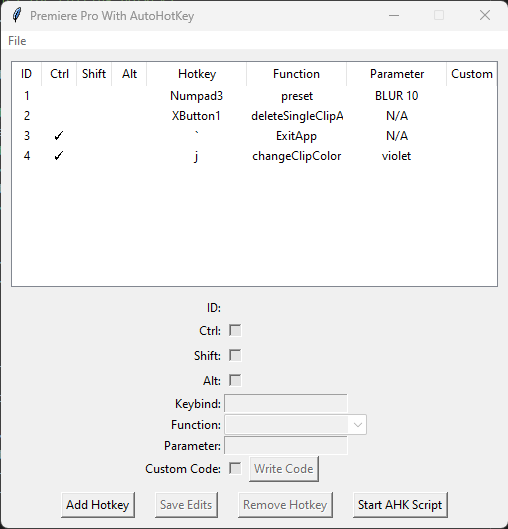
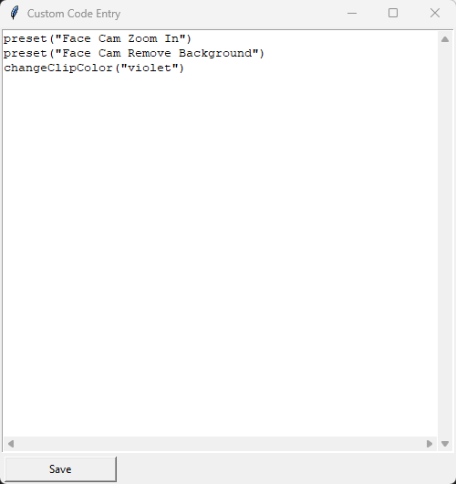
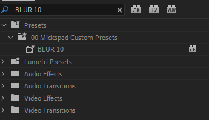

# Premiere Pro with AutoHotKey (Version 0.2)

## NOTICE: THIS PROJECT IS CURRENTLY IN AN ALPHA STATE!
This program will work with basic functionality, but only a selection of the most useful functions are ready to go at the current moment

## Overview

This is a revamped version of the Premiere Pro editing automation scripts originally created by Taran Van Hemert.

Many of his implementations are perfectly functional, but to the average user (or even many power users), sifting through a large amount of code that was primarily written for one person's specific setup to customize it for their own can be difficult. So my goal with this project is to make an easier to use and configure version of what Taran had built so that more people can have access to this amazing functionality.

Many of Taran's original functions are re-written to follow better coding standards and practices while also giving video editors who don't want to learn how to code the opportunity to use these functions through a simple to use visual interface to create and edit their hotkeys.

If you want an idea of how these functions are used in practice, check out Taran's original set of tutorials. I plan on making my own eventually, but that's going to come once the project reaches version 1.0, I don't want to take the time to make a video tutorial until things are more concrete

* [Taran's Repository](https://github.com/TaranVH/2nd-keyboard/tree/master)
* [Taran's Original Tutorials](https://www.youtube.com/watch?v=O6ERELse_QY&list=PLH1gH0v9E3rvSfrVbny6Wswe_68bPu9n1)
* [My Tutorial (COMING EVENTUALLY)]()

## Contents
* [Getting Started](#getting-started)
* [Setting Hotkeys Visually](#setting-hotkeys-visually)
* [Setting Hotkeys Manually](#setting-hotkeys-manually)
* [Functions Available To Use](#functions-available-to-use)
* [Premiere Pro Mods](#premiere-pro-mods)
* [Updating The Program](#how-do-i-update)
* [Authors](#authors)
* [Version History](#version-history)
* [Projected Future Implementations](#projected-future-implementations)
* [License](#license)
* [Acknowledgements](#acknowledgments)


## <a name="getting-started"></a> Getting Started

### Required Dependencies

* Adobe Premiere Pro on either Windows 10 or Windows 11
    * Mac is unsupported by AutoHotKey and therefore cannot be used unfortunately
* [AutoHotKey](https://www.autohotkey.com/download/) (Scripts are built on AHK v1.1, NOT 2.0)
    * AHK 2.0 is the current a default version but as Taran's scripts were originally written years ago and I have no familiarity with 2.0, this does use the old version
    * I may migrate these scripts to version 2.0 in the future, but it's not a high priority at the current moment

### Optional Dependencies
* Python
    * This is optional because all of the scripts are available for you to run, but the .exe is being offered as an alternative if you don't wish to install Python
    * This may become a required dependency in the future (although with all the work I've put in to avoid making it a requirement, I doubt I'm going to give up now)

### How to Run This Program

* Downloading This Program
    * At the top of the GitHub page, click on the drop down button "<> Code" and click "Download ZIP"
    * Extract the zip into wherever you want to keep the program
        * The .zip file MUST be extracted, otherwise the setup program will appear as if it's running as intended with no errors, but won't actually do the setup process (make a dedicated folder for this program before extracting)

* Run First Time Setup
    * Run "FirstTimeSetup.exe" and follow the on screen instructions to build your config file
        * This will pop up with a windows defender warning, in order to get rid of that, I need to submit this program to Microsoft to be added to their approved softwares, and as this is just a fun side project, I don't exactly want to do that so... just tell it to run anyway. I know that's sketchy and I apologize, I will try to fix this in the future.
        * If you have Python installed and would like to run this in script form instead of running it via the executable, the script to run is "UserConfiguration.py" in the Setup_Scripts folder
    * Once you run through the questions, you should see the file "PremiereWithAHKConfig.ini" appear inside the "config" folder

* Create Your Hotkeys
    * Once you have your config file, Start creating your hotkeys through one of two methods:
        1. Use the visual hotkey manager to create and edit your hotkeyswithout having to write the code yourself
            * To do this, run "Configurator.exe"
            * Check the section [Setting Hotkeys Visually](#setting-hotkeys-visually) for more information on how to do this
        2. Manually Code your own hotkeys inside of the file "ManualCustomHotkeys.ahk" inside of the "config" folder
            * If you do not have previous familiarity with AutoHotKey, I DO NOT recommend doing this, I am including it as an option in case someone wants to use these functions without using the configurator
            * Check the section [Setting Hotkeys Manually](#setting-hotkeys-manually) for more information on how to do this

* Run The Program
    * Once you have your hotkeys set up, double click on "PremiereProWithAutoHotKey.ahk" to run the program
    * You can also create a shortcut to that script so you can launch that program from anywhere

## Setting Hotkeys Visually
When building your hotkeys using the configurator, you will be presented with this screen. This is the configurator and it will allow you to make your own hotkeys.



If you are running for the first time, the list at the top should be empty, I have it filled with some examples for ease of explanation.

### Making and Editing Hotkeys

Clicking the "Add Hotkey" button or clicking an existing hotkey in the list at the top will bring that hotkey into the "editing area".

Once inside the editing area, you can make adjustments to the hotkey. The "Keybind" will allow you to select what key will activate your custom hotkey, and the checkboxes above will determine if Ctrl, Alt, and Shift are required to activate it. The keybind written must be in the format that AutoHotKey understands. For most keys, it is just the key being pressed (like "j"), but for other keys (such as the numpad, function keys, etc) they must be written as AutoHotKey notates the keys (my mouse has a back button function, and in order for that to be detected, it has to be listed as "XButton1").

A list of these keys can be found [here.](https://www.autohotkey.com/docs/v1/KeyList.htm)

I do plan on updating this in the future to allow you to record a keyboard input rather than having it be typed in manually, but I'm working on this bit by bit.

### Functions and Parameters

What is a function?
    * A function is a block of code that does a specific task.
What is a parameter?
    * A parameter is a piece of information given to a function so that it can complete it's task

Selecting a function from the dropdown menu allows you to pick what your specified hotkey actually does. A list of all the possible options and what they actually do can be found later in this README in [this section](#functions-available-to-use)

In this program, there are many choices for different tasks within Premiere Pro that can be automated.

For a quick example, if I wanted to add a 10% blur to the clip I'm hovering over with my mouse, I save the effect to a custom folder in Premiere with the name "BLUR 10", select the function "preset", and select the parameter "BLUR 10" so it known that's the specific effect I'm looking to add to the clip. Once the hotkey is activated, it will open up the effect page, find the effect you wrote in, and add it to whatever clip is under your mouse when you activated the hotkey.

Some functions do not require parameters while others do, and that information will be detailed in the section linked above.


### Custom Code

For some users, you may want to have a hotkey perform functionality that's a bit more complicated than just running one function. If that's the case, the Custom Code section is built to accommodate that.

If you would like to run custom code instead of the specified function, click the checkbox in the custom code section, this will ignore any input in the function and parameter section, and to actually write your custom code, click the "Write Code" button and it will take you to this page



On this page, you can write your own AutoHotKey code that will be added to the specified hotkey

If you do not have previous familiarity with AutoHotKey, I recommend only using this like I have shown in the example image where it is used to do multiple commands sequentially.

### Other Aspects of the Configurator

* Update Premiere Hotkeys
    * This is found in the file menu
    * If you make updates to your keybaord shortcuts in Premiere, this program will not be able to automatically tell that changes were made, and you must press this button in order for everything to update to your new Premiere Pro shortcuts
    * This will take your shortcuts from the .kys file you specified during your first time setup
* Change Premiere Hotkey File
    * This is found in the file menu
    * This allows you to select a new .kys file to reconfigure this program based on
    * After selecting the new .kys file, it will automatically run "Update Premiere Hotkeys" for you, so you don't need to hit the button a second time

## Setting Hotkeys Manually
I do not recommend doing this if you do not have previous familiarity with AutoHotKey, I recommend using the configurator, and skipping this section entirely.

When building out your own hotkeys in "ManualCustomHotkeys.ahk", you can call a variety of functions to do automated tasks in Premiere

To call one of these functions, use the following syntax:
```autohotkey
INSERT_HOTKEY_HERE::
    ; NAME_OF_HOTKEY
    FUNCTION_NAME(FUNCTION_PARAMETERS)
Return
```

For an actual example, this hotkey is activated with "CTRL + j" and adds an effect called "shakeScreen20" to the clip below the cursor
```autohotkey
^j::
    ; CTRL + j - shakeScreen20 Preset
    preset("shakeScreen20")
Return
```

When making the hotkeys it is important to note the modifier keys:
- ^ means CTRL
- \+ means SHIFT
- !  means ALT

If you want a more thorough idea of how to set up your hotkeys, check the file "UserHotkeysEXAMPLE.ahk" in the Example Files folder.

This is a basic explanation, for functionality that goes beyond this, you're going to need to go through AutoHotKey coding tutorials and documentation.

## Functions Available to Use

The functions will be listed as follows:
* FunctionName("PARAMETER")
    * The FunctionName is what you will pick from the dropdown list in the configurator
    * The parameter is what information needs to be given to the function in order to make it operate properly
    * If the function is listed with an empty set of parentheses, that means that there is no parameter needed for the function to operate
    * Why is it written like this? Because I started writing this when there was no configurator, and this is how you have to write it when making the hotkeys manually, and I didn't feel like re-writing all of them

### Non-Premiere Related Functions

* ExitApp()
    * Stops AutoHotKey
    * I personally like to have this set to CTRL + ` (the key next to the "1" key on the keyboard)
    * This function is not required, but I HIGHLY recommend you have it set in case something goes wrong and you can instantly stop the automation scripts

### Essential Functions
The following is a list of functions and exaplanations for what they do that are contained in the Essential_Functions.ahk script

* preset("EFFECT_NAME")
    * Adds a custom effect to the clip your mouse is hovering over
    * The parameter needs to be an exact match to the name of the effect you want to add
    * The effect you want to use MUST be in an effects folder like shown in this image
    * 
    * The way this works under the hood is by looking for the magnifying glass and then moving the mouse a set distance to the effect, so if your custom effect is not in a folder like shown in the image above, it will miss the effect and try to drag one of the effect folders onto the clip instead of the effect

* searchForEffect("EFFECT_NAME")
    * Opens the search box and looks for the specified effect name
    * Since preset() already does this AND adds the effect to your clip, I would recommend using this in situations where you may have multiple functions like "CROP20", "CROP30", "CROP40", etc. and you set a hotkey to search "CROP" to get all of them easily rather than to look for one specific effect, but how you want to integrate it into your workflow is up to you

* deleteSingleClipAtCursor()
    * Allows with a single button press to delete whatever is currently underneath the cursor, but will NOT delete whatever that clip is linked to (So if you have an audio track under the cursor, it will not delete the corresponding video)

* effectsPanelFindBox()
    * Opens the effects panel and places your cursor inide the search box, allowing you to type in the box instantly
    * Premiere technically has the functionality to set this as a hotkey, but it will not work unless the correct "panel" is in focus, and this will automatically pull the effects panel into focus before selecting the find box

* marker()
    * Stops playing any video and places a marker at the playhead
    * While Premiere technically already has a keyboard shortcut for this, this is more reliable since it forces a stop on the timeline

### Extended Functions
The following is a list of functions and exaplanations for what they do that are contained in the Extended_Functions.ahk script

Using these functions without having required Premiere Keyboard Shortcuts set will not result in the program erroring out and automatically closing like the commands needed for the essential functions to work will. Instead, if you attempt to use one of these functions without a required keybaord shortcut, it will stop running the function and inform you that you need to set it in order to use the function.

I set it up this way because I don't want the entire program to shut itself down just because a user doesn't have a keyboard shortcut set for setting a clip to the color Yellow.

* instantVFX("EFFECT_NAME")
    * CURRENTLY UNFINISHED, WILL UPDATE README WHEN IN A FULLY WORKING STATE

* clickTransformIcon()
    * CURRENTLY UNFINISHED, WILL UPDATE README WHEN IN A FULLY WORKING STATE

* cropClick()
    * CURRENTLY UNFINISHED, WILL UPDATE README WHEN IN A FULLY WORKING STATE

* changeClipColor("COLOR_NAME")
    * Changes the selected clip to a specified color
    * Custom color names are not able to be parsed, so to use this with a custom color you set, you need to use the name of what the color originally was or the number of the position (starting with 1 at the top) that the color appears inside of the preferences page
    * Because this is just pressing a hotkey you set in Premiere, I do not recommend using this function standalone as you'd be setting a keyboard shortcut to another keybaord shortcut
    * I recommend using this function as part of more complex custom functions you create for yourself, such as wanting a single key to both add a preset to a clip and then immediately change the timeline color of that clip like the example shown below
    * ```autohotkey
        ^j::
            ; CTRL + J - Stream Highlight Facecam
            preset("facecam background cutout")
            preset("facecam zoom in")
            changeClipColor("lavender")
        Return
      ```


### Audio Functions
The following is a list of functions and exaplanations for what they do that are contained in the Audio_Functions.ahk script

* addGain(AMOUNT)
    * CURRENTLY UNFINISHED, WILL UPDATE README WHEN IN A FULLY WORKING STATE
        * The code for this is complete, but there's a bug where Premiere is still reading the hotkey that activated the function (default Premiere shortcut for opening the gain adjustment window is "G", I set the function to Ctrl + j, and it activated Ctrl + g, I can fix it for the next version but it's broken in this version for now)
    * Adds gain to whatever audio clip is currently selected
    * The amount given must be a number

* insertSFX("SOUND_EFFECT_NAME")
    * CURRENTLY UNFINISHED, WILL UPDATE README WHEN IN A FULLY WORKING STATE
    * Inserts the specified sound effect to the timeline at the current cursor position

* audioMonoMaker("TRACK")
    * CURRENTLY UNFINISHED, WILL UPDATE README WHEN IN A FULLY WORKING STATE
    * Converts the selected audio clip to Mono
    * Input for track must be "right" or "left", not specifying will default to the left Audio Track


### Taran Functions
The Taran_Functions.ahk script contains functions from Taran's original scripts that I wanted to keep included in case anyone got specific use out of them, but as of right now, they are low priority to implement, and if I decide to implement any of them, they will likely move to one of the other scripts.

I would only recommend looking deeper into these functions if you have previous familiarity with AutoHotKey and Premiere, I have done minor formatting adjustments on the functions, but not much work beyond that.

## Premiere Pro Mods
Mods are extra scripts that run separately from the primary script and change slight aspects of how Premiere Pro works, currently there are two, but only one is semi-supported in this current version.

More information will be added in the next update once they're implemented in a more concrete way, but if you want to go through them now, check the files labeled "PPMOD" inside of the Premiere Functions folder.

## How Do I Update?
I'm going to be honest with you here, chief... I am learning as I'm going, so I don't exactly know how to implement an actual update function into this, and even if I did, this project is early in development so parts of this might be heavily overhauled.

The best thing to do if you want the newest version of this project when updates are made is to redownload the code, and copy anything from your old version's config folder into the new one. I'm going to try my best to eventually make a way to just hit a button and update the program and keep all of your changes, but for the time being, "hold onto your config files" is genuinely the best advice I can give. This is meant to help you edit videos easier, but it's also a project being done in my spare time by a person who's only ever contributed to other projects, never headed their own before.

## Authors

**Mickspad**
- [Youtube](https://www.youtube.com/mickspad)
- [Twitter](https://www.Twitter.com/mickspad)


## Version History

* Version 0.1
    - Initial release
    - Included basic scripts for creating your configuration file from a premiere pro .kys file
    - Included functionality for preset() and associated other functions
    - Wrote the README
    - Included placeholders for future ideas regarding GUI and automated hotkey generation
    - Included executable for the initial version of the setup process
* Version 0.2
    - Added GUI Interface for making and editing custom hotkeys
    - Added more functions including changeClipColor()
    - Overhauled aspects of the AHK program to allow for GUI Generated hotkeys
    - Expanded the Script Writer to generate scripts based on a .json file
    - Overhauled README to include explanations of how the GUI operates

## Projected Future Implementations
I believe that version 1.0 is on the horizon, the requirements before I will consider myself at version 1.0 is when I finish getting a few more of the Premiere functions working and make the gui a bit less confusing to use.

I do plan on overhauling the look of the gui to something a bit easier on the eyes, but that's probably not something I will require to consider the project at version 1.0 since the GUI is functional even if it's not pretty.


## License

This program is open and free to use and modify however you see fit for your own use case, but if you have ideas for vast improvements, you have permission to make your own project, but before you do, I ask that you reach out first and let me know because I don't mind having improvements be made within this repo if it can benefit everyone using it.

## Acknowledgments

This project would not have been possible without the amazing work done by Taran Van Hemert with his original scripts which were the basis for this entire project.

I also would like to thank the following people for being willing to help me through testing the functionality:
* Eight Faye - [Twitter](https://twitter.com/Eight_Faye)